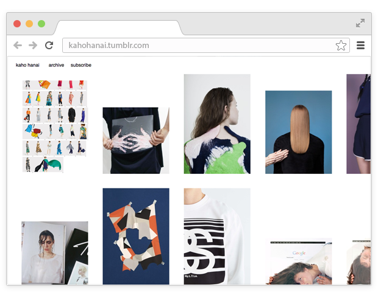
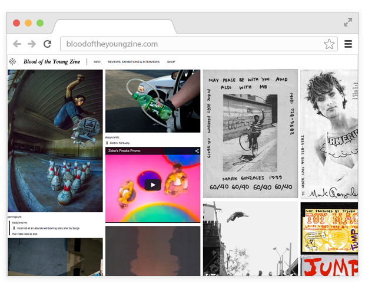
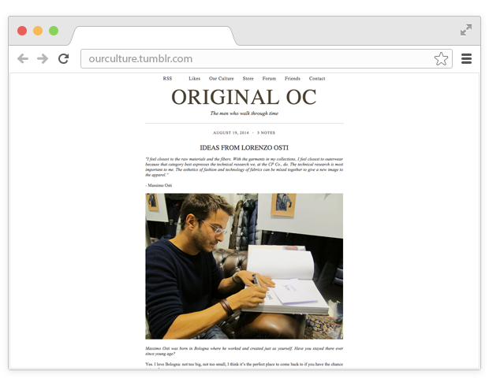
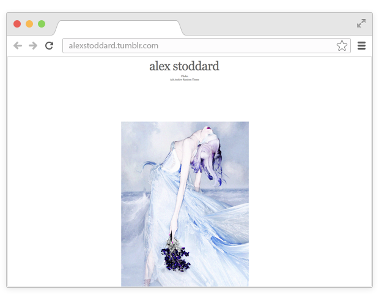
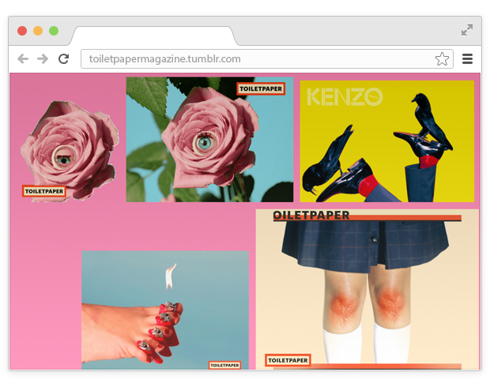
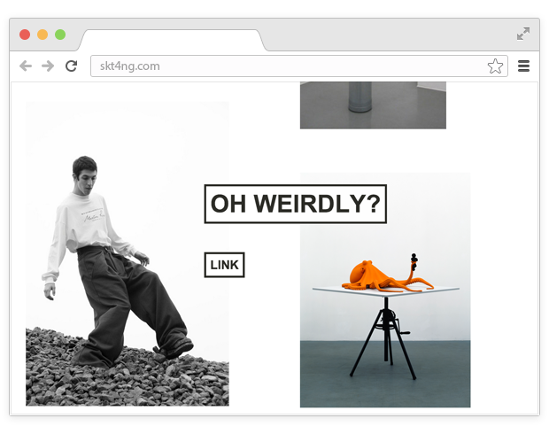

# Photographers advise where to look for pictures for inspiration
## Best Tumblers for Professionals

We asked young Russian photographers who had managed to win recognition to make a list of favorite resources that inspire their creativity.

Eric Panov

I often use a tape of toggle switches, which are signed for the reference shootings, but lately for me the toggle switch has fallen into the background, now there are many interesting installations and public.

I don't know whose toggle switch it is, I can only assume that it is made by a Japanese or a Chinese or a Korean - there is no information. On the other hand, there is an excellent selection of shots with lookbooks, fashion shoots and their interpretation. Everything is in a single, fairly graphic context.

Probably, many people know it as a site with art in all its manifestations. I discovered a lot of Japanese artists and graphic artists on it.

A great installation by a guy named Doug Abraham, who makes collages from famous advertising campaigns, fashion shooting, combining them with screenshots from movies, porn footage, and anything at all. It often looks much cooler than the original shootings.

A forum that is wildly uncomfortable to search and view, but it seems to have everything that has ever been associated with the world of fashion: from the archives of advertising campaigns over the years to the most recent shootings that have not yet been published on other similar resources.

I browse "VKontakte" exclusively for the sake of some public. This is one of the few: photos, spaces, installations - good content.

Asia, Africa, "quality" and sexual message, people, things and nature, inspiration.

My favorite tumbler. This is my childhood - something I was looking at and dreaming about. Where I am now, it's all here.

My friend's page. I miss you.

A great informative tumbler, interesting for every man.

Works of Alex, a very talented guy.
 
A real inspiration. Any time when it's sad and boring, I check this page and think how cool hanging out before.

